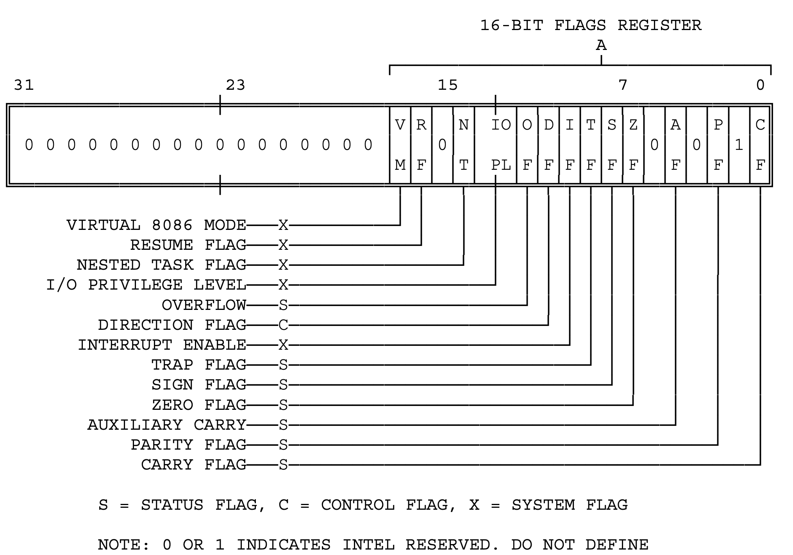

This Note include some concepts in x86 and x86-64 Architecture.

### Register

#### General Purpose Registers

There are 14 General Purpose Registers in x86 architecture.

| 64bits | 32bits | 16bits | 8bits high | 8bits low | convension                            |
| ------ | ------ | ------ | ---------- | --------- | ------------------------------------- |
| %rax   | %eax   | %ax    | %ah        | %al       | Return value and accumulator Register |
| %rbx   | %ebx   | %bx    | %bh        | %bl       | Base Regitser                         |
| %rcx   | %ecx   | %cx    | %ch        | %cl       | Counter Register                      |
| %rdx   | %edx   | %dx    | %dh        | %dl       | Data Register                         |
| %rsi   | %esi   | %si    |            | %sil      | Source  Index Register                |
| %rdi   | %edi   | %di    |            | %dil      | Destination Index Register            |
| %r8    | %r8d   | %r8w   |            | %r8b      |                                       |
| %r9    | %r9d   | %r9w   |            | %r9b      |                                       |
| %r10   | %r10d  | %r10w  |            | %r10b     |                                       |
| %r11   | %r11d  | %r11w  |            | %r11b     |                                       |
| %r12   | %r12d  | %r12w  |            | %r12b     |                                       |
| %r13   | %r13d  | %r13w  |            | %r13b     |                                       |
| %r14   | %r14d  | %r14w  |            | %r14b     |                                       |
| %r15   | %r15d  | %r15w  |            | %r15b     |                                       |

#### Special Purpose Registers

| 64bits | 32Bits | 16bits | 8bits high | 8bits high | Convension                   |
| ------ | ------ | ------ | ---------- | ---------- | ---------------------------- |
| %rsp   | %esp   | %sp    |            | %spl       | Stack Pointer Register       |
| %rbp   | %ebp   | %bp    |            | %bpl       | Base Pointer                 |
| %rip   | %eip   |        |            |            | Instruction Pointer Register |

#### Flags Register

| 64bits  | 32Bits  | 16bits | 8bits high | 8bits high | Convension                |
| ------- | ------- | ------ | ---------- | ---------- | ------------------------- |
| %rflags | %eflags | %flags |            |            | Flags and condition codes |

The graph below illustrate the flags register in 8086

#### System Register