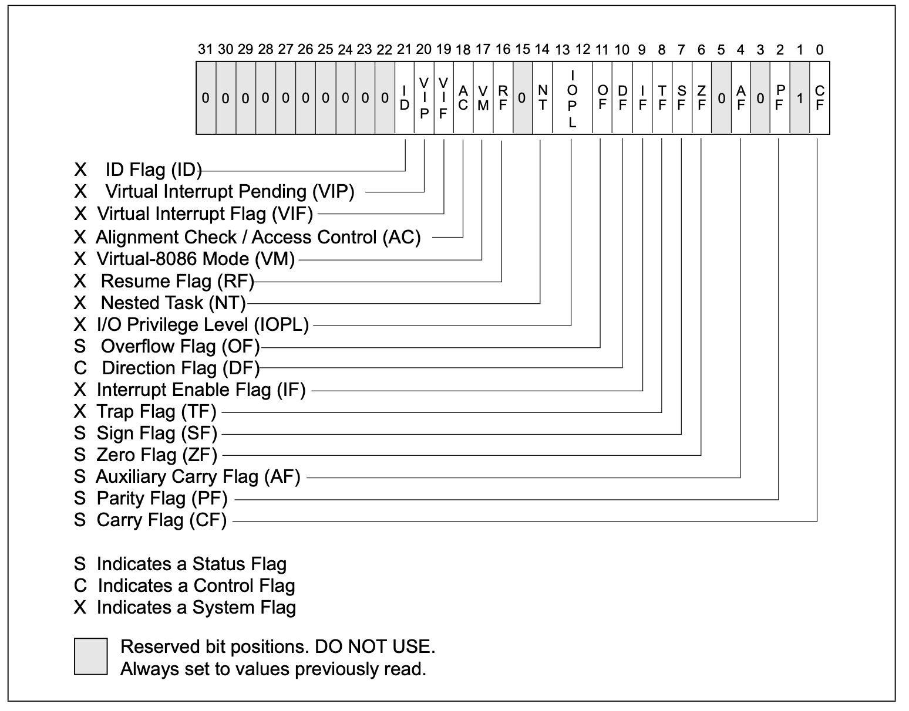

This Note include some concepts in x86 and x86-64 Architecture.

# Programming Model

## Addressing Mode
The addressing model in IA-32 Architecture can be summarized as offset(base, index, scale). Which refer to the address offset + base + index * scale.  
- offset : Must be a constant
- base: Must be registers
- index : Must be registers
- scale : Must be either 1, 2, 4 or 8.

This table below describe all addressing ways in AT&T

| Syntax              | Value used                                          | Type      |
| ------------------- | --------------------------------------------------- | --------- |
| %rbp                | Contents of %rbp                                    | Register  |
| $0x04               | 0x04                                                | Immediate |
| 0x04                | Value stored at address 0x04                        | Memory    |
| symbol_name         | Value stored at address symbol_name                 | Memory    |
| symbol_name(%rip)   | %rip relative addressing                            | Memory    |
| symbol_name+4(%rip) | %rip relative addressing                            | Memory    |
| (%rax)              | Value stored at address  in %rax                    | Memory    |
| 0x4(%rax)           | Value stored at address  in %rax + 4                | Memory    |
| (%rax, %rbx)        | Value stored at address  in %rax + %rbx             | Memory    |
| (%rax, %rbx, 4)     | Value stored at address  in %rax + %rbx * 4         | Memory    |
| 0x18(%rax, %rbx, 4) | Value stored at address  in %rax  + 0x18 + %rbx * 4 | Memory    |

## Function Call Convention

### i386
This is a 32-bit platform. The stack grows downwards. Parameters to functions are passed on the stack in reverse order such that the first parameter is the last value pushed to the stack, which will then be the lowest value on the stack.

### x86_64

| Position | Usage                       |
| -------- | --------------------------- |
| %rdi     | 1st  function argument      |
| %rsi     | 2nd function argument       |
| %rdx     | 3rd function argument       |
| %rcx     | 4th function argument       |
| %r8      | 5th function argument       |
| %r9      | 6th function argument       |
| Stack    | 7th - nth function argument |
| %rax     | return value                |

Function called Sequence in x86_64

1. To prepare for a function call, the caller should do the following tasks:
	1. Store the first six arguments to the corresponding registers.
	2. If need more then six arguments the caller should push them on the stack.
	3. The caller saves any caller-saved registers (the value of these registers might be modified by callee).
	4. The caller executes _callq FUNCTION_.
2. To return from a function, the callee should do the following
	1. The callee places its return value in %rax
	2. The callee restore the stack pointer to its value at entry
	3. The callee executes _retq_ instruction. 
3. Then the caller free memory it allocate for arguments and restores caller-saved registers. 

# Register

## General Purpose Registers

There are 14 General Purpose Registers in x86 architecture.

| 64bits | 32bits | 16bits | 8bits high | 8bits low | convension                                 |
| ------ | ------ | ------ | ---------- | --------- | ------------------------------------------ |
| %rax   | %eax   | %ax    | %ah        | %al       | Accumulator for operands and results data. |
| %rbx   | %ebx   | %bx    | %bh        | %bl       | Base Regitser                              |
| %rcx   | %ecx   | %cx    | %ch        | %cl       | Counter Register                           |
| %rdx   | %edx   | %dx    | %dh        | %dl       | I/O pointer                                |
| %rsi   | %esi   | %si    |            | %sil      | Source  Index Register                     |
| %rdi   | %edi   | %di    |            | %dil      | Destination Index Register                 |
| %r8    | %r8d   | %r8w   |            | %r8b      |                                            |
| %r9    | %r9d   | %r9w   |            | %r9b      |                                            |
| %r10   | %r10d  | %r10w  |            | %r10b     |                                            |
| %r11   | %r11d  | %r11w  |            | %r11b     |                                            |
| %r12   | %r12d  | %r12w  |            | %r12b     |                                            |
| %r13   | %r13d  | %r13w  |            | %r13b     |                                            |
| %r14   | %r14d  | %r14w  |            | %r14b     |                                            |
| %r15   | %r15d  | %r15w  |            | %r15b     |                                            |

Suffix of the operand
- b : means byte which is 1 byte
- w: means word which is 2 bytes
- l : means long which is 4 bytes
- q: means quad word which is 8 bytes

## Special Purpose Registers

| 64bits | 32Bits | 16bits | 8bits high | 8bits high | Convension                   |
| ------ | ------ | ------ | ---------- | ---------- | ---------------------------- |
| %rsp   | %esp   | %sp    |            | %spl       | Stack Pointer Register       |
| %rbp   | %ebp   | %bp    |            | %bpl       | Pointer to data on the stack |
| %rip   | %eip   |        |            |            | Instruction Pointer Register |

## Segment Registers

## Flags Register

| 64bits  | 32Bits  | 16bits | 8bits high | 8bits high | Convension                |
| ------- | ------- | ------ | ---------- | ---------- | ------------------------- |
| %rflags | %eflags | %flags |            |            | Flags and condition codes |

The graph below illustrate the flags register in IA-32

##### Status Flags

Here is a graph interpret the meaning of every bit in flags Register of status flags. (Index start from 1) 

| Flags | Bits | Meaning                    | Value    |
| ----- | ---- | -------------------------- | -------- |
| CF    | 0    | If the result carried      | unsigned |
| ZF    | 6    | If the result was zero     |          |
| SF    | 7    | If the result was negative | signed   |
| OF    | 11   | If the result overflowed   | signed   |

##### System Flags

## System Register

# Instructions

## Computation 

## Data Movement

## Control Flow

### Jump Instructions
**Unconditional Jump** 

| Instruction | Mnemonic | C Language | Value |
| ----------- | -------- | ---------- | ----- |
| j           | Jump     |            |       |
| jmp         | Jump     |            |       |

**Compare Jump** 

| Instruction | Mnemonic                 | C Language  | Value    |
| ----------- | ------------------------ | ----------- | -------- |
| je          | Jump if equal            | if (x == y) |          |
| jne         | Jump if not equal        | if (x != y) |          |
| jg          | Jump if greater          | if (x > y)  | Signed   |
| jge         | Jump if greater or equal | if (x >= y) | Signed   |
| jl          | Jump if less             | if (x < y)  | Signed   |
| jle         | Jump if less or equal    | if (x <= y) | Signed   |
| ja          | Jump if greater          | if (x > y)  | Unsigned |
| jae         | Jump if greater of equal | if (x >= y) | Unsigned |
| jb          | Jump if less             | if (x < y)  | Unsigned |
| jbe         | Jump if less or equal    | if (x <= y) | Unsigned |

**Status Jump**

| Instruction | Mnemonic                 | C Language  | Value  |
| ----------- | ------------------------ | ----------- | ------ |
| js          | Jump if sign bit         | if (x < 0)  | Signed |
| jns         | Jump if not sign bit     | if (x >= 0) | Signed |
| jc          | Jump if carry bit        |             |        |
| jnc         | Jump if not carry bit    |             |        |
| jo          | Jump if overflow bit     |             |        |
| jno         | Jump if not overflow bit |             |        |

### Function Call Instructions
