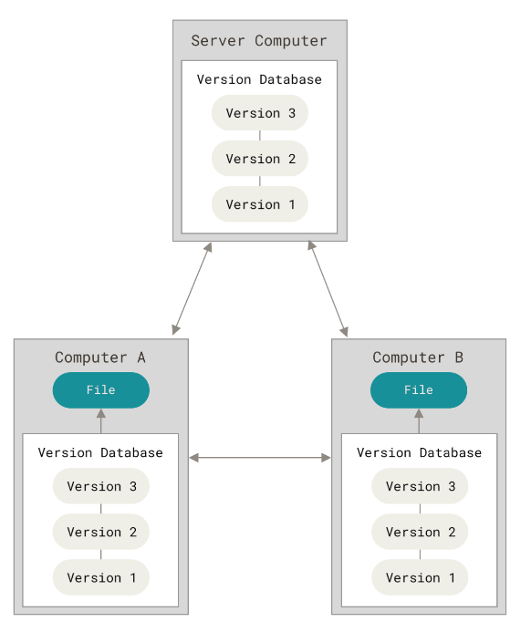

Version control is a system that records changes to a file or set of files over time. Git is a powerful Distributed Version Control System. This note will introduce some basic aspects of git, git interfaces and dive into the core of git.

# Git General

Here is the Git working model, git is a Distributed Version Control System (DVCS). Every computer has its own copy and is independent to the server. 


## Git Internal

There are three main states that your files can resides in git.

- Modified : Modified means that you have changed the file but have not committed it to your database yet.
- Staged : Staged means that you have marked a modified file in its current version to go into your next commit snapshot.
- Committed : Committed means that the data is safely stored in your local database.

This will lead us to the three main sections of a Git project : the working tree, the staging area, and the Git directory.

And all of the files in the git repository have two state : Tracked or Untracked
- Tracked files: Tracked files are files that were in the last snapshot, they can be unmodified, modified or staged.
- Untracked files : Untracked files are everything else, any files in your working directory that were not in your last snapshot and not in your staging area.


## Git Utilities

### gitignore

Git has a special file called .gitignore, every file name or directory in .gitignore that git will not automatically add or show you as being untracked. Git ignore file is using a match pattern similar to the Regular Expression.

Pattern List
- * : Matches zero or more characters
- `[abc]` : matches any character inside the brackets ()a, b or c
- ? : matches a single character
- `[0-9]`: matches any character between them. 

| Pattern    | Usage                                                                       |
| ---------- | --------------------------------------------------------------------------- |
| FILENAME   | Ignore FILENAME in the current directory                                    |
| DIRECTORY/ | Ignore all files in DIRECTORY                                               |
| *.[oa]     | Ignore all files end with .o or .a                                          |
| *ENDS      | Ignore all files name ends with ENDS                                        |
| A/**/Z     | Ignore all Z files in the directory of A and all of the subdirectories of A |
| !FILE      | Negate ignore, this will not ignore FILE                                    |

# Git Command

## Initialize

### config

Git comes with a tool called _git config_ that lets you get and set configuration variables that control all aspects of how Git looks and operates.
These variables can be stored in three different places:

1. [path]/etc/gitconfig file: Contains values applied to every user on the system and all their repositories. Can be controlled using _--system_ option.
2. ~/.gitconfig file : Values specific for the user. Can be controlled using _--global_ option.
3. config file in the Git Repository: Values specific for the current repository. Can be controlled using _--local_ option. (the default option)


Searching Path Related Options

| Option   | Usage                                                                  |
| -------- | ---------------------------------------------------------------------- |
| --system | Read or write configuration values from [path]/etc/gitconfig           |
| --global | Read or write configuration values from ~/.gitconfig                   |
| --local  | Read or write configuration values from .git/config (default behavior) |

Main Options

| Option        | Usage                                                          |
| ------------- | -------------------------------------------------------------- |
| --list        | List all variables set in config file, along with their values |
| --show-origin | Show the origin of the configuration file and their type       |


Configuration Variable

| Variable           | Usage                       |
| ------------------ | --------------------------- |
| user.name          | User name                   |
| user.email         | User email                  |
| core.editor        | Set default text editor     |
| init.defaultBranch | Set the default branch name |


### init

_git init_ will create an empty Git repository or reinitialize an existing one.

### clone 
_git clone_ will clone a repository into a newly created directory.

## General

### help
_git help_ display the help information about Git in manpage. General form of usage `git help <verb>`. Similar way for getting help is just type `-h` in the command

```shell
git config -h
```


## Snapshotting

### add
_git add_  add file contents to the staging area. This command takes a path name for either a file or a directory, if it's a directory the command adds all the files in that directory recursively.

### status
_git status_  show the working tree status.


| Option     | Usgae                                         |
| ---------- | --------------------------------------------- |
| -s --short | Show the working tree status in a compact way |

### diff
_git diff_  show changes between commits, commit and working tree.


| Options           | Usage                                       |
| ----------------- | ------------------------------------------- |
| git diff          | Compare working directory with staging area |
| git diff --staged | Compare staged change with the last commit  |

### commit

_git commit_ record changes to the repository


| Option       | Usage                                                                          |
| ------------ | ------------------------------------------------------------------------------ |
| -m --message | Specify the commit message                                                     |
| -a           | Automatically stage every file that is already tracked before doing the commit |

### rm
_git rm_ removes the files from the working tree and staging area.

| Option          | Usage                                                  |
| --------------- | ------------------------------------------------------ |
| git rm          | Remove the file from the working tree and staging area |
| git rm --cached | Remove the file only from the staging area             |
## Branching


## Remote


