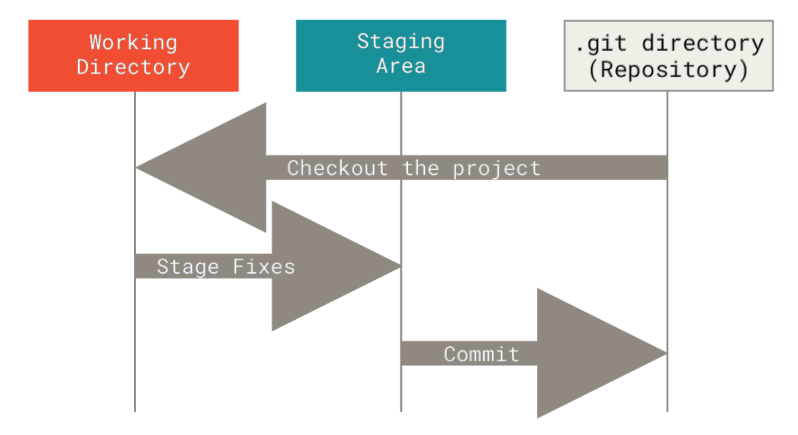

Version control is a system that records changes to a file or set of files over time. Git is a powerful Distributed Version Control System. This note will introduce some basic aspects of git, git interfaces and dive into the core of git.

# Git Concept

## File Status

There are three main states that your files can resides in git.

- Modified : Modified means that you have changed the file but have not committed it to your database yet.
- Staged : Staged means that you have marked a modified file in its current version to go into your next commit snapshot.
- Committed : Committed means that the data is safely stored in your local database.

This will lead us to the three main sections of a Git project : the working tree, the staging area, and the Git directory.

# Git Command

## Setup

### init

_git init_ will create an empty Git repository or reinitialize an existing one.

## Configuration

## Snapshotting

### add
_git add_

## Branching

## Remote
